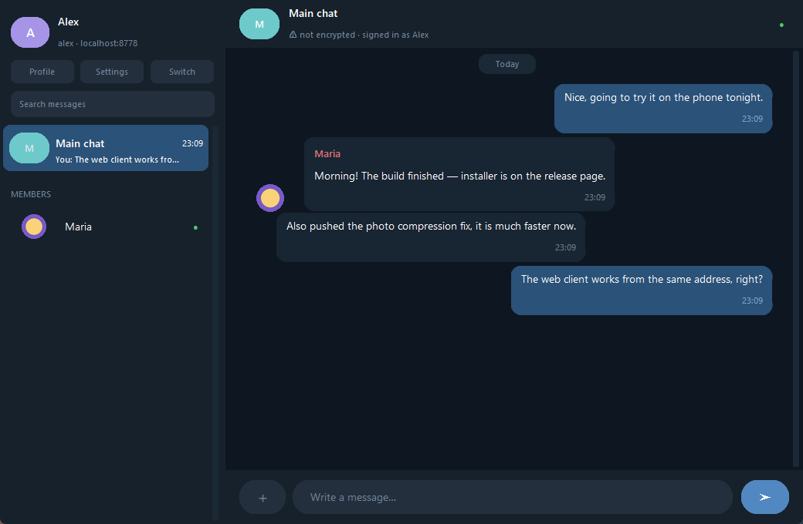
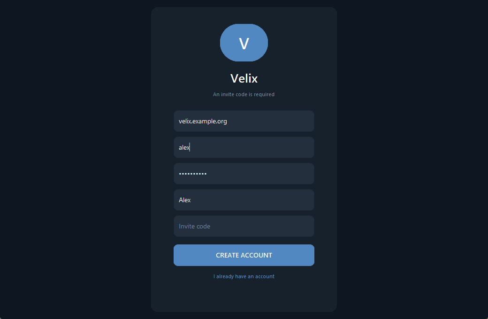
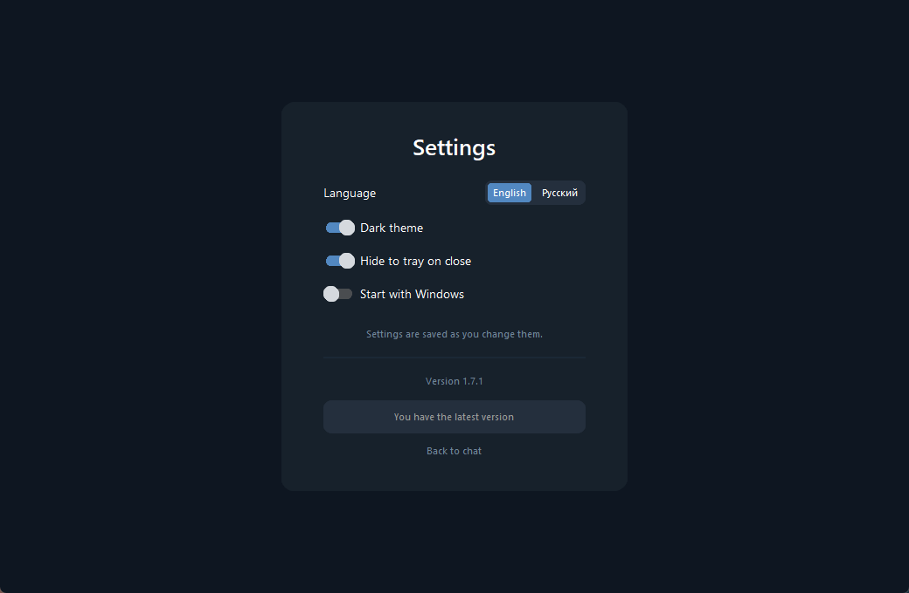

<div align="center">

# Velix

**A self-hosted messenger you can actually run yourself.**
One small Python server, a Windows desktop app, a native Android app and a mobile web client — all speaking the same WebSocket protocol.

[](https://www.python.org/)
[](#windows-app)
[](#phones)
[](#encryption)
[](#interface-language)

English · [Русский](README.ru.md)



</div>

---

## What it is

Velix is a private chat for a handful of people who know each other: a family, a
group of friends, a small team. You run the server yourself — on a Raspberry Pi
at home, on a VPS, on any machine that stays on — and nobody else holds your
messages.

Everything is deliberately small and boring: one SQLite file for history, plain
files for attachments, no message queue, no container stack, no cloud account.
The server is a single `python server.py` away.

**What you get**

| | |
|---|---|
| 💬 **Conversations** | Groups with their own name and photo, plus one-to-one direct chats. Unread messages show up as a red count next to the name. A group is deleted by whoever created it. Reply, react, pin, forward, copy, delete-your-own, full-text search, typing indicator, who-is-online — from a message menu that opens on right-click or long-press. |
| ✓✓ **Delivery ticks** | One grey tick — the server took it. Two grey — it reached the other side. Two blue — it was read. In a group one reader is enough: people read at their own pace, and waiting for the quietest member means waiting forever. |
| 📷 **Attachments** | Photos, GIFs (animated in place), video up to 1 GB and any other file up to 500 MB — big ones travel in chunks instead of landing in memory whole. Open a photo full-window and zoom it with the wheel, by dragging, or with the buttons. Paste a screenshot straight from the clipboard. Images are compressed server-side — a 7.5 MB phone photo lands at ~400 KB. |
| 👤 **Accounts** | Invite-only registration, scrypt password hashing, session tokens, brute-force lockout. A recovery code instead of email resets. Profile with a name, a bio and a photo. |
| 🔒 **Encryption** | TLS 1.3 (`wss://`) with a Let's Encrypt certificate. The client falls back to plain `ws://` only if the server has no certificate — and says so on screen. |
| 📱 **Phones** | A native Android app (`Velix.apk`) — real Android views, not a web page in a frame, with notifications for new messages. The web client is still there for iPhones. |
| 🔄 **Updates** | A button in Settings. The server hands out the fresh build, the client swaps itself and restarts — no reinstall. |
| 🌍 **Two languages** | English and Russian, switched in Settings, applied instantly. |
| 🛠 **Control panel** | The chat owner gets an extra button in Settings: how much space attachments and the database take, how much is free on the disk, who writes how much. Users and conversations are deleted from there too, and the file and video limits are set there. |

## Quick start

```bash
pip install -r requirements.txt
python server.py
```

The server listens on port 8765 over both IPv4 and IPv6, so it accepts
connections from the same machine and from the local network.

Then start a client — the desktop app:

```bash
python gui.py
```

…or the terminal one, which speaks the same protocol:

```bash
python client.py
```

In the address field you can type a bare host (`velix.example.org`,
`192.168.0.225`) or a host with a port (`velix.example.org:9000`). Without a
port, 8765 is assumed. The client tries `wss://` first and falls back to `ws://`.

Registration needs an invite code — mint one on the server:

```bash
python invite.py "for Maria"    # issue a code
python invite.py --list         # see who used what
```

<div align="center">


</div>

## Windows app

The published `Velix.exe` is a single file with Python inside — nothing to
install alongside it. Ready-made builds live on the
[Releases](https://github.com/Vexorter42/Velix-messenger/releases) page:
`VelixSetup.exe` installs into the user profile, so it never asks for
administrator rights, creates Start-menu and desktop shortcuts, and uninstalls
the normal way.

Building it yourself needs `pip install pyinstaller`:

```bash
python -m PyInstaller --noconfirm --onefile --windowed --name Velix --icon icon.ico --add-data "icon.ico;." --collect-all customtkinter --collect-all darkdetect gui.py
```

The installer is compiled from `installer.iss` with Inno Setup 6, with the built
`Velix.exe` sitting next to it:

```bash
"%LOCALAPPDATA%\Programs\Inno Setup 6\ISCC.exe" installer.iss
```

The binaries are not committed — they are 30-odd megabytes and rebuildable. The
version lives in `version.py` and must match `AppVersion` in `installer.iss`.

## Phones

### The Android app

`Velix.apk` on the
[Releases](https://github.com/Vexorter42/Velix-messenger/releases) page is a
native client: the screens are ordinary Android views and it speaks the same
WebSocket protocol as the desktop app. It is signed by hand rather than by a
store, so Android will ask permission to install it. On first launch it asks
for the server address and remembers it.

It does what the desktop client does: sign-in and registration, the list of
chats and members, direct chats and groups, history, photos from the gallery
and full-screen viewing, delivery ticks, reactions, replies, pin, forward,
copy, delete — and both languages. A long press on a group in the list changes
its photo or deletes it.

**Notifications.** The connection lives in a service, not on the screen: it
keeps running on its own, shows a "Velix is online" line in the shade and posts
a notification when a message arrives while the app is in the background. That
line cannot be hidden — without it Android puts the connection to sleep within
minutes. On first launch the app asks for notification permission (Android 13
and newer); decline it and everything else still works.

While the app is away, unread messages are counted and shown as a red badge
next to the conversation name.

There is no third-party library inside: even the WebSocket is hand-written
(`android/java/org/vexorter/velix/Ws.java`), because the Android framework has
no client of its own and pulling one in would drag Gradle along with it. The
build needs only the Android SDK:

```bash
python android/build.py
```

**What it does not do yet:** notifications once the app has been shut down
entirely (swiped away from recents, or after a reboot before the first launch).
The service survives backgrounding and network loss, but not being killed — for
that you need Firebase, a Google account and a project of its own.

### The web client

Nothing to install, and the way onto an iPhone: the server hands it out at the
same address and port as the chat itself.

```
https://velix.example.org:8765/
```

Through the browser menu ("Add to home screen") the page installs like a normal
app — its own icon, no address bar. The session token is remembered, so the
password is asked once. It carries the same features, plus push notifications
when the app is closed.

The pages live in `web/` and are served from `server.py` itself, so there is no
second web server and no second port to forward. A plain GET returns a file; a
request carrying `Upgrade: websocket` goes to the chat.

## Forgotten passwords

There is no email reset here — we ask for no email, and the server sits in
someone's home. Instead every account gets a **recovery code** when it is
created: four groups of four characters, shown once, stored only as a scrypt
hash. "Forgot your password?" on the sign-in screen asks for the username, that
code and a new password.

The code is single-use: after it works you are given a fresh one. Changing the
password also drops every session, so anyone who had the old password is signed
out.

If the code is lost too, whoever runs the server issues a new one and hands it
over in person — the same way invite codes travel:

```bash
python recover.py gosha     # issue a new code
python recover.py --list    # who has a code and who does not
```

Guessing the code is rate-limited exactly like guessing the password: five
misses lock that username for five minutes.

## Interface language

The interface ships in **English by default** and switches to Russian in
Settings (desktop) or in the profile screen (mobile). The choice is remembered
and applied immediately — no restart.

Server-side messages carry a code alongside the Russian text, so an error the
server generated is shown in the language the reader chose. Push notifications
follow the language the phone subscribed with.

Translations live in `i18n.py` (desktop, console) and `web/i18n.js` (mobile).
The key of a translation is the Russian source string, which keeps the code
readable and makes a missing translation obvious.

## Self-hosting

### Encryption

The server speaks `wss://` — the same TLS that protects banking sites. Point it
at a certificate and a key:

```bash
VELIX_CERT=/path/fullchain.pem VELIX_KEY=/path/privkey.pem python server.py
```

Without those variables it starts on plain `ws://` and says so in the log. The
client shows an "not encrypted" mark in the chat header in that case.

For a DuckDNS domain the certificate is issued over a DNS challenge, so port 80
does not need to be free:

```bash
sudo certbot certonly --manual --preferred-challenges dns \
  --manual-auth-hook /usr/local/lib/velix/duckdns-auth.sh \
  --manual-cleanup-hook /usr/local/lib/velix/duckdns-cleanup.sh \
  --deploy-hook /usr/local/lib/velix/velix-deploy.sh \
  -d '*.yourname.duckdns.org'
```

Ask for the wildcard only — a domain and its wildcard need the same TXT record,
and DuckDNS stores just one, so the second request overwrites the first. The
wildcard covers every subdomain anyway.

### Who may connect

By default the server accepts anyone who reaches the port. Set
`VELIX_ALLOWED_HOSTS` and it will only accept connections that arrived under the
listed names:

```bash
VELIX_ALLOWED_HOSTS=velix.example.org,localhost python server.py
```

The name comes from the `Host` header of the handshake; everyone else gets a
`403`. This is not a security boundary — a `Host` header is forged in a minute —
but a scanner sweeping addresses and ports does not know the name and never
reaches the chat.

### Backups

`backup.sh` snapshots the database through `sqlite3 .backup`, so the copy is
consistent even if someone is writing a message at that moment. Attachments are
copied as hard links and cost disk space only once. The last 14 copies are kept
in `~/velix-backups`. Once a day from cron:

```bash
30 4 * * * $HOME/velix/backup.sh >> $HOME/velix-backups/backup.log 2>&1
```

### The control panel

The chat owner is whoever registered first, or whoever's login is named in
`VELIX_ADMIN`. They get a "Control panel" button in Settings:

* how many messages and attachments there are, how much space they take and
  how much is left on the Pi's disk;
* who is in the chat and how much each of them wrote — each with a Delete
  button;
* which conversations exist and how many people are in them — likewise with
  Delete;
* the attachment limits: how large a file and a video may be. The numbers live
  in the database, so they survive a restart.

A deleted account disappears while its messages stay: otherwise conversations
would grow holes and the other side would lose half the exchange. A deleted
conversation takes its messages and attachments with it, and that cannot be
undone. You cannot delete yourself.

### A test server next to the live one

Paths and the port come from environment variables, so a spare server can live
on the same machine with its own data and never touch the real conversations:

```bash
VELIX_PORT=8766 VELIX_DB=~/velix-test/velix.db VELIX_MEDIA=~/velix-test/media python server.py
```

### Handing out an update

The server keeps `updates/Velix.exe` and `updates/version.txt` next to itself
and tells every client which version it has. If it is newer than the client's,
the Update button in Settings lights up.

```bash
~/velix/publish-update.sh /path/to/Velix.exe 0.2.3.0
sudo systemctl restart velix
```

**Version numbers** look like `0.2.2.0`. The leading zero says the first round
release is still ahead; it does not count when versions are compared, so
`0.2.2.0` and `2.2.0` mean the same thing. A big addition moves the second
digit (`0.2.1.0` → `0.2.2.0`), a small or middling one moves the last
(`0.2.2.0` → `0.2.2.1`).

The swap works around the fact that a running exe cannot be overwritten but can
be renamed: the old file moves aside as `Velix.exe.old`, the new one takes its
place, the app restarts and cleans up the leftover on the next start. If
anything fails halfway, the old file comes back.

### Environment variables

| Variable | What it does |
|---|---|
| `VELIX_PORT` | Port to listen on (default 8765) |
| `VELIX_DB` | Path to the SQLite file |
| `VELIX_MEDIA` | Directory for attachments |
| `VELIX_WEB` | Directory with the web client |
| `VELIX_CERT`, `VELIX_KEY` | TLS certificate and key |
| `VELIX_ALLOWED_HOSTS` | Comma-separated host names allowed to connect |
| `VELIX_OPEN_REGISTRATION` | `1` drops the invite requirement |
| `VELIX_UPDATES` | Directory with the build handed out to clients |
| `VELIX_ADMIN` | Login of the chat owner; without it the owner is whoever registered first |
| `VELIX_CACHE` | Where the client keeps downloaded attachments (default: next to the settings) |
| `VELIX_PUSH_KEYS` | Path to the VAPID key file |
| `VELIX_LANG` | Interface language of the console client |

## Large attachments

An image travels in a single frame: it gets compressed anyway, and a phone
photo ends up under a megabyte. Video and files are another matter, so they go
in four-megabyte chunks:

1. the client says "here comes a file, this many bytes";
2. the server agrees and opens a temporary file for it;
3. the client sends chunks, the server appends them and reports the progress;
4. once everything has arrived, the file moves into storage and becomes a
   message.

It is handed back the same way — chunk by chunk, straight off the disk. Neither
the server nor the client ever holds a gigabyte of video in memory: the Pi
would not survive it, and neither would a phone.

Clients remember what they have already downloaded: attachments sit next to the
settings along with scaled-down copies of the images. A conversation with two
dozen photos therefore opens instantly instead of pulling them over the network
on every launch. The cache is allowed 500 MB, beyond which it drops whatever
has gone untouched the longest.

## How it is built

| File | What lives there |
|---|---|
| `server.py` | Connections, delivery, presence, the web client, updates |
| `storage.py` | SQLite: messages, users, sessions, conversations, reactions, subscriptions |
| `protocol.py` | The shared language: JSON frames, attachment kinds, size limits |
| `accounts.py` | Passwords, login checks, session tokens |
| `media.py` | Server-side image compression |
| `push.py` | Push notifications through the browser's own service |
| `gui.py` | The desktop client, in Telegram's visual language |
| `client.py` | The terminal client |
| `web/` | The mobile web client |
| `android/` | The native Android app: WebSocket, protocol, screens, Gradle-free build |
| `i18n.py`, `web/i18n.js` | Interface translations |
| `store.py` | What the client remembers between runs |
| `tray.py`, `autostart.py` | Tray icon, start with Windows |
| `updates.py`, `version.py` | Updating in place |
| `invite.py` | Invite codes |
| `recover.py` | Recovery codes for a forgotten password |
| `backup.sh`, `publish-update.sh`, `test-server.sh` | Server-side chores |

A message travels as a JSON text frame; the bytes of an attachment follow in a
separate binary frame. The desktop client keeps the network on its own thread
with its own asyncio loop and talks to the interface through a queue — Tkinter
must not be touched from another thread.

Attachment payloads are never pushed to a client on their own: history carries
only the description, and the bytes are requested when it is time to show them.
Video is fetched only when the button is pressed, so opening a chat does not
drag in every clip at once.

## Limits, honestly

- **No end-to-end encryption.** Messages are protected in transit, but they sit
  in the clear on the server — whoever controls the machine can read them.
- **Groups have no admins**: anyone in a group can invite anyone else, and
  nobody can be removed.
- **No flood protection** and no message length limit.
- **The history file is not encrypted**: anyone with access to `velix.db` has
  the whole correspondence.

It is a private messenger for people who trust the person running the server —
not a tool for keeping secrets from that person.
